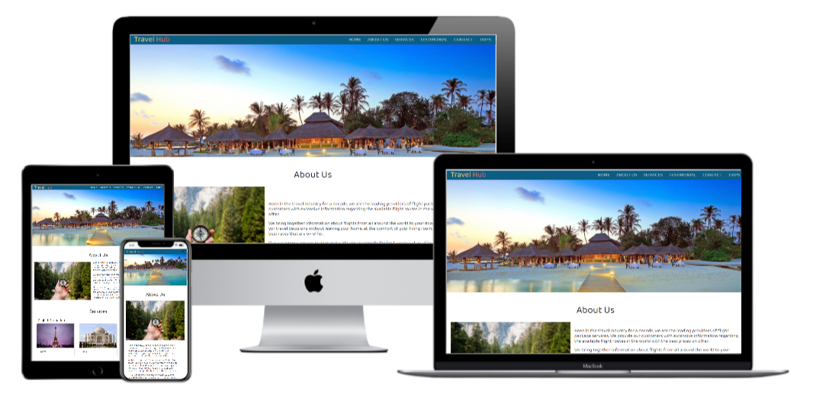

<h1 align="center">Travel Hub Website</h1>

[View the live project here.](https://johnnyferns14.github.io/javascript-milestone-project-2/)

The site with travel information relating to flights.
 
<h2 align="center"></h2>

## User Experience (UX)

-   ### User stories

    -   #### First Time Visitor Goals

        1. As a First Time Visitor, I want to want to make sure that I get the information I want based on the site description.
        2. As a First Time Visitor, I want to be able to easily navigate throughout the site to find content.
        3. As a First Time Visitor, I want to look for testimonials to understand what their users think of them and see if they are trusted. I also want to locate their social media links to see their followings on social media to determine how trusted and known they are.

    -   #### Returning Visitor Goals

        1. As a Returning Visitor, I want to find information about the flight packages.
        2. As a Returning Visitor, I want to find the best way to get in contact with the organisation with any questions I may have.
        3. As a Returning Visitor, I want to find community links.

    -   #### Frequent User Goals
        1. As a Frequent User, I want to check to see if there are any newly added packages or offers or if the company has moved in to offer other variety of travel services including car-hire, hotels, etc..
        2. As a Frequent User, I want to check to see if there are any new blog posts.
        3. As a Frequent User, I want to sign up to the Newsletter so that I am emailed any major updates and/or changes to the website or organisation.

-   ### Design
    -   #### Colour Scheme
        -   The two main colours used are blue, and white.
    -   #### Typography
        -   The Baloo Paaji 2 font is the main font used throughout the whole website with cursive as the fallback font in case for any reason the font isn't being imported into the site correctly. The font is unique and gives a feeling of calmness. Also, it is both attractive and appropriate for the travel site.
    -   #### Imagery
        -   Video of a coast with mountains has been added as the background giving a feel of the place from the sky. It gives a feeling of travel, holiday, excitement.

*   ### Wireframes

    -   Home Page Wireframe - [View](https://github.com/johnnyferns14/javascript-milestone-project-2/blob/master/assets/PDF/Figma%20Homepage%20wireframe.pdf)

    -   Mobile Wireframe - [View](https://github.com/johnnyferns14/javascript-milestone-project-2/blob/master/assets/PDF/Mobile%20wireframe.pdf)

    - Information: The above are wireframes that were designed in the initial process. But as the project went on, changes were made to make every content look better and more attractive.

## Features

-   The website is responsive on all device sizes ranging from desktop to tablet & mobiles.

-   Interactive elements

## Technologies Used

### Languages Used

-   [HTML5](https://en.wikipedia.org/wiki/HTML5)
-   [CSS3](https://en.wikipedia.org/wiki/Cascading_Style_Sheets)

### Frameworks, Libraries & Programs Used

1. [Bootstrap 4.0:](https://getbootstrap.com/docs/4.0/getting-started/introduction/)
    - Bootstrap was used to assist with the responsiveness and styling of the website.
1. [Google Fonts:](https://fonts.google.com/)
    - Google fonts were used to import the 'Titillium Web' font into the style.css file which is used on all pages throughout the project.
1. [Font Awesome:](https://fontawesome.com/)
    - Font Awesome was used on all pages throughout the website to add icons for aesthetic and UX purposes.
1. [jQuery:](https://jquery.com/)
    - jQuery came with Bootstrap to make the navbar responsive but was also used for the smooth scroll function in JavaScript.
1. [Git](https://git-scm.com/)
    - Git was used for version control by utilizing the Gitpod terminal to commit to Git and Push to GitHub.
1. [GitHub:](https://github.com/)
    - GitHub is used to store the projects code after being pushed from Git.
1. [Photoshop:](https://www.adobe.com/ie/products/photoshop.html)
    - Photoshop was used to create the logo, resizing images and editing photos for the website.
1. [Figma:](https://figma.com/)
    - Figma was used to create the [wireframes](https://github.com/) during the design process.

## Testing

The W3C Markup Validator and W3C CSS Validator Services were used to validate every page of the project to ensure there were no syntax errors in the project.

-   [W3C Markup Validator](https://jigsaw.w3.org/css-validator/#validate_by_input) - [Results](https://github.com/johnnyferns14/javascript-milestone-project-2/blob/master/assets/images/HTML%20Validator.jpg)
-   [W3C CSS Validator](https://jigsaw.w3.org/css-validator/#validate_by_input) - [Results](https://github.com/johnnyferns14/javascript-milestone-project-2/blob/master/assets/images/CSS%20Validator.jpg)

### Testing User Stories from User Experience (UX) Section

-   #### First Time Visitor Goals

    1. As a First Time Visitor, I want to easily understand the main purpose of the site and learn more about the organisation.

        1. Upon entering the site, users are automatically greeted with a clean and easily readable navigation bar to go to the section of their choice. Below the navigation bar, is a video background that gives a good sense of communication.
        2. The full aspect of the website is shown by the video - depicts a travel scene.

    2. As a First Time Visitor, I want to be able to easily be able to navigate throughout the site to find content.

        1. The site has been designed to be fluid and never to entrap the user. At the top of each page there is a clean navigation bar, each link describes what the page they will end up at clearly.
        2. The content on the page is appropriately placed so as to give a good visual feedback to the user.
        3. On the Contact Us Page, after a form response is submitted, an alert shows up stating that their submission was a success.

    3. As a First Time Visitor, I want to look for testimonials to understand what their users think of them and see if they are trusted. I also want to locate their social media links to see their following on social media to determine how trusted and known they are.
        1. Once the new visitor has read the About Us and services section, they will move on to the Testimonials section which give the users an understanding of what our esteemed clients think of us.
        2. The user can also scroll to the bottom of any page on the site to locate social media links in the footer which have a slow transition when hovered over.
        3. When clicked, the user is directed to the respective homepage of that site.
        4. There is a 'Trips' section in the navigation bar which when clicked, will take the user to the trips page.
        5. Here, the user will get the flight details such as origun, destination, departure date, flight and the price.

-   #### Returning Visitor Goals
   
    1. As a Returning Visitor, I want to find the best way to get in contact with the organisation with any questions I may have.

        1. The navigation bar clearly highlights the "Contact Us" Page.
        2. Here they can fill out the form on the page.
        3. The footer contains links to the organisations Facebook, Twitter, Linkedin and Instagram page.
        4. Whichever link they click, it will be open up in a new tab to ensure the user can easily get back to the website.
        5. The email button is set up to automatically open up your email app and autofill there email address in the "To" section.

-   #### Frequent User Goals

    1. As a Frequent User, I want to check to keep checking for any possible updates to the site.

        1. The user would be able to get updates since they will have submitted details through the contact form.

    2. As a Frequent User, I want to check to see if there are any new blog posts regarding travel information.

        1. All updates will be made in the social network pages which is already integrated in the footer.

    

### Further Testing

-   The Website was tested on Google Chrome, Internet Explorer, Microsoft Edge and Safari browsers.
-   The website was viewed on a variety of devices such as Desktop, Laptop, iPhone7, iPhone 8 & iPhoneX.
-   Due to the limit of info in the api, the users will have to enter the IATA codes instead of place name and currency code in caps. 
-   A large amount of testing was done to ensure that all pages were linking correctly.
-   Friends and family members were asked to review the site and documentation to point out any bugs and/or user experience issues.

### Known Bugs

-   Due to limited functionality of the api, the user will need to enter the IATA code or Country Code in the From & To inputs and the currency code (in caps) in the currency input. Please refer to this [website](https://www.nationsonline.org/oneworld/country_code_list.htm) for the list of country codes.
- The api shows only direct flights between major airports of the world.

## Deployment

### GitHub Pages

The project was deployed to GitHub Pages using the following steps...

1. Log in to GitHub and locate the [GitHub Repository](https://github.com/)
2. At the top of the Repository (not top of page), locate the "Settings" Button on the menu.
    - Alternatively Click [Here](https://raw.githubusercontent.com/) for a GIF demonstrating the process starting from Step 2.
3. Scroll down the Settings page until you locate the "GitHub Pages" Section.
4. Under "Source", click the dropdown called "None" and select "Master Branch".
5. The page will automatically refresh.
6. Scroll back down through the page to locate the now published site [link](https://github.com) in the "GitHub Pages" section.

### Forking the GitHub Repository

By forking the GitHub Repository we make a copy of the original repository on our GitHub account to view and/or make changes without affecting the original repository by using the following steps...

1. Log in to GitHub and locate the [GitHub Repository](https://github.com/)
2. At the top of the Repository (not top of page) just above the "Settings" Button on the menu, locate the "Fork" Button.
3. You should now have a copy of the original repository in your GitHub account.

### Making a Local Clone

1. Log in to GitHub and locate the [GitHub Repository](https://github.com/)
2. Under the repository name, click "Clone or download".
3. To clone the repository using HTTPS, under "Clone with HTTPS", copy the link.
4. Open Git Bash
5. Change the current working directory to the location where you want the cloned directory to be made.
6. Type `git clone`, and then paste the URL you copied in Step 3.

```
$ git clone https://github.com/johnnyferns14/javascript-milestone-project-2
```

7. Press Enter. Your local clone will be created.

```
$ git clone https://github.com/johnnyferns14/javascript-milestone-project-2
> Cloning into `CI-Clone`...
> remote: Counting objects: 10, done.
> remote: Compressing objects: 100% (8/8), done.
> remove: Total 10 (delta 1), reused 10 (delta 1)
> Unpacking objects: 100% (10/10), done.
```

Click [Here](https://help.github.com/en/github/creating-cloning-and-archiving-repositories/cloning-a-repository#cloning-a-repository-to-github-desktop) to retrieve pictures for some of the buttons and more detailed explanations of the above process.

## Test Data

## Credits

### Code


-   [Bootstrap4](https://getbootstrap.com/docs/4.0/getting-started/introduction/): Bootstrap Library used throughout the project mainly to make site responsive using the Bootstrap Grid System.

-   [jQuery:](https://jquery.com/)
 jQuery came with Bootstrap to make the navbar responsive but was also used for the smooth scroll function in JavaScript.


### Content

-   All content was written by the developer.


### Media

-   Images were found freely from the internet. For the testimonials, cartoon images were taken from [Cartoonist website](https://thecartoonist.me/)

-  The background video was downloaded from <a href="https://pixabay.com/?utm_source=link-attribution&amp;utm_medium=referral&amp;utm_campaign=image&amp;utm_content=15527">Pixabay</a> work of <a href="https://pixabay.com/users/wowa84-7649734/?utm_source=link-attribution&amp;utm_medium=referral&amp;utm_campaign=image&amp;utm_content=15527">- Wowa84</a>

### Acknowledgements

-   My Mentor for continuous helpful feedback.

-   Tutor support at Code Institute for their support.
